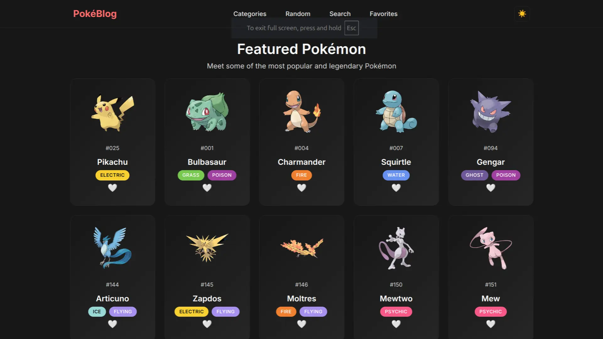
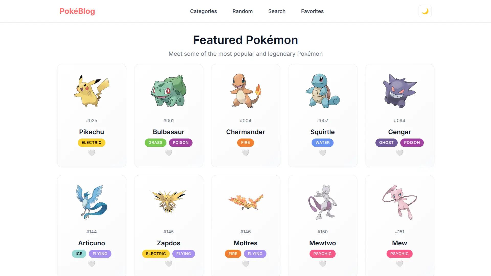

<div align="center">
  <h1><strong>Prototype Web Native</strong></h1>
  <a href="https://prototype-web-native.vercel.app/"><strong>Deploy on Vercel</strong></a>
</div>

<p align="center">
Pokédex-style web application built with <strong>Vanilla JavaScript</strong>, allowing you to explore, search, and manage favorite Pokémon using data from the <strong><a href="https://pokeapi.co/">PokéAPI</a></strong>.
</p>

<p align="center">
  <a href="https://developer.mozilla.org/en-US/docs/Web/HTML">
    
  </a>
  <a href="https://developer.mozilla.org/en-US/docs/Web/CSS">
    
  </a>
  <a href="https://developer.mozilla.org/en-US/docs/Web/JavaScript">
    
  </a>
  <a href="https://vercel.com/">
    
  </a>
</p>




## ✨ Features

* 📋 **Pokémon list** with interactive cards.
* 🔎 **Advanced search** by name or Pokédex number.
* 📂 **Categories** by elemental types (Fire, Water, Grass, etc.).
* ⭐ **Favorites** persisted in `localStorage`, with JSON export and import.
* 🎲 **Random Pokémon** with a single click.
* 📊 **Pokémon details** with stats, abilities, and evolution chain.
* ⚡ **Responsive UI** with loaders, empty states, and error handling.

## ⚙️ Installation

Clone the repository.

```bash
git clone git@github.com:tyronejosee/prototype_web_native.git
cd prototype_web_native
````

Install dependencies.

```bash
npm install
```

Start a local server.

```bash
npm run dev
```

Open in your browser.

```bash
http://localhost:5173
```

## 📦 Available Scripts

* `npm run dev` → start server in development mode
* `npm run build` → build for production
* `npm run preview` → preview the build

## ⚖️ License

This project is licensed under the [MIT License](./LICENSE).

Enjoy! 🎉
